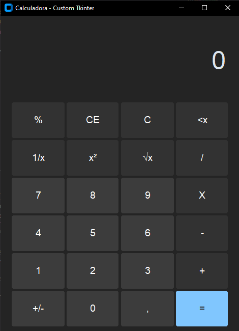

<h1 align="center">Calculadora Simples - Custom Tkinter</h1>

Este é um programa de calculadora simples com design semelhante ao do Windows 10.

    

---

### 🔣 Operações:

- [x] operações básicas: adição, subtração, divisão, multiplicação
- [x] extrai raiz quadrada
- [x] eleva ao quadrado
- [x] resto ou módulo
- [x] inverso multiplicativo
- [x] valor inverso

---

### 🛠 Tecnologias usadas:

- [Python3](https://www.python.org)
- [Custom Tkinter](https://pypi.org/project/customtkinter)
